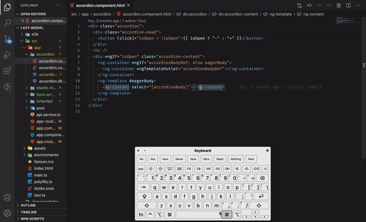

# ng-switch

Simple VS Code extension enabling file switching between template and controller files in Angular projects

## Features

Press `Ctrl+Alt+Y` or `Cmd+Y`(mac) to make the switch!

Or type `switch` in vscode command pallete(`Ctrl+Shift+P`)

If in a stylesheet, pressing `Ctrl+Alt+Y` or `Cmd+Y` will switch to the templating file

## Release Notes

Users appreciate release notes as you update your extension.

### 1.0.0

Initial release of ng-switch with minimal functionality

**Enjoy!**
